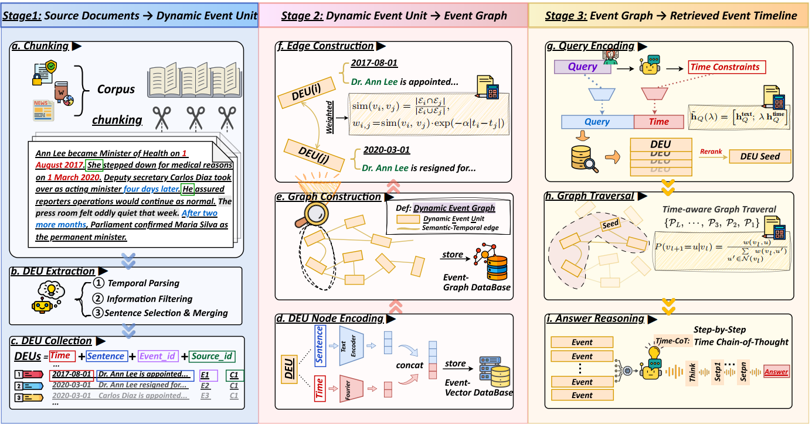

# ⭐ DyG-RAG: Dynamic Graph Retrieval-Augmented Generation with Event-Centric Reasoning ([PDF](https://www.arxiv.org/abs/2507.13396))

DyG-RAG is **the first event-centric dynamic graph retrieval-augmented generation framework** specifically designed to capture, organize, and reason over temporal knowledge embedded within unstructured text data. By explicitly modeling the temporal dynamics of events as graph-structured representations, DyG-RAG facilitates enhanced temporal reasoning, yielding substantial accuracy improvement in temporal QA task.

### The overall framework of DyG-RAG:

<div align="center">
  
</div>

---

## ✨ Key Contributions

1. **First Dynamic Graph Structure for Temporal Textual Knowledge**: We introduce the first dynamic graph retrieval-augmented generation system that structures and stores temporal textual knowledge from an event-centric perspective.
2. **Event Granularity with Explicit Temporal Encoding**: We propose a novel dynamic event unit (DEU) granularity that explicitly embeds temporal information into the knowledge organization stage, enabling fine-grained temporal encoding.
3. **RAG-Reasoning Integration for Downstream Tasks**: The construction of DyG naturally supports the integration of retrieval-augmented generation with temporal reasoning for downstream temporal QA tasks, enabling the Time-CoT prompting approach.
4. **Empirical Validation**: We have verified DyG-RAG's superior performance across three distinct types of temporal question-answering datasets, demonstrating its effectiveness in real-world scenarios.

## 🚀 Quick Start

### 1. Environment Setup

```bash
cd DyG-RAG
conda create -n dygrag python=3.10
conda activate dygrag
# Install dependencies
pip install -r requirements.txt
```

### 2. OpenAI Configuration

Set your OpenAI API key:

```bash
# Option 1: API-Environment variable
export OPENAI_API_KEY="your_api_key_here"
```

### 3. Download Models

```bash
# Download required models
cd models
python download.py
```

**Downloaded Models:**

The script downloads two essential models:

1. **Cross-Encoder Model**:

   - Model name: `cross-encoder/ms-marco-TinyBERT-L-2-v2`
   - Local path: `./models/cross-encoder_ms-marco-TinyBERT-L-2-v2/`
   - Size: ~67MB
2. **NER Model**:

   - Model name: `dslim/bert-base-NER`
   - Local path: `./models/dslim_bert_base_ner/`
   - Size: ~1.2GB

### 4. Local Model Configuration[optional]

If you want to use local models instead of OpenAI, you can set up environment variables for the local embedding and LLM configuration (using BGE and Qwen as examples):

```bash
# Local BGE embedding model path (example: BGE-M3)
export LOCAL_BGE_PATH="/path/to/your/bge-m3"

# VLLM API service URL (example: local VLLM server)
export VLLM_BASE_URL="http://127.0.0.1:8000/v1"

# Model name for LLM (example: Qwen model)
export QWEN_BEST="qwen-14b"
```

### 5. Run Examples

```bash
# Basic usage with OpenAI
cd examples
python openai_all.py

# Using local models
python local_BGE_local_LLM.py
```

## 📁 Code Structure

```
DyG-RAG/
├── requirements.txt  # Dependencies
├── examples/         # Usage examples
├── graphrag/         # src codes of DyG-RAG
├── demo/             # TimeQA dataset example
├── datasets/         # three types of temporal QA datasets
└── models/           # Downloaded models
```

## 📝 TODO

1. Support for More Model Choices
2. Support for Diverse Vector Databases
3. Support for Diverse Graph Databases

## 🙏 Acknowledgments

This project is built upon the excellent work of [nano-graphrag](https://github.com/gusye1234/nano-graphrag) by Gustavo Ye. We extend our sincere gratitude to the original author for providing a simple, easy-to-hack GraphRAG implementation that serves as the foundation for our DyG-RAG system.
